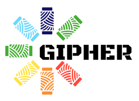

# Gipher - A Capsule Case Study

This project is an application which allows a user to access the GIF images from https://giphy.com/. It also allows the user to add the GIFs to Favourites, add and update comments to the GIFs, view popular GIFs in the Recommended section and also search for GIFs.
The user has to first register and then login to get a personalized set of GIF images.

## Salient features of the Gipher application:

1. A secure registration and login process for the users.
2. A user can
  - view the most trending GIFs on the dashboard.
  - add the GIFs to the Favourites.
  - add and update comments for the selected GIFs.
  - view the popular GIFs in the Recommended section. The Recommended section will show the number of likes of a particular GIFs based on the users adding that GIF to their favourites list. User can also add Gifs to their Favourites from the Recommended section.
  - search for GIFs from https://giphy.com/. The individual searches are stored into the database.

## Modules and Services in the Gipher Application:

- AccountManager - This is the Authentication service for the Gipher application.
- GipherManager - This is the Gif Manager service for the Gipher application.
- GipherRecommenderSystem - This is the Gif Recommender service for the Gipher application.
- GipherUI - This is the Angular frontend service for the Gipher application.
- EurekaService - This is the Eureka service for the Gipher application.
- ZuulService - This is the Zuul service for the Gipher application.
 

## Modules used in development of the Giper Application:

- Spring Boot
- MySQL, MongoDB
- API Gateway
- Eureka Server
- Message Broker (RabbitMQ)
- Angular
- CI (Gitlab Runner)
- Docker, Docker Compose

## List of services and ports

Gipher_accountmanager: 9084

Gipher_giphermanager: 9085

Gipher_gipherrecommendersystem: 9086

Gipher_frontend: 8080

Gipher_EurekaService: 9009

Gipher_ZuulService: 9087

Gipher_mongodb: 27017

Gipher_mysqldb: 3306

rabbitmq: 5672, 15672

## Steps for installation and deployment of the Gipher Application

Ensure that git, docker, docker-compose, npm, node.js are installed on your local machine.

Clone this repository to your local machine.

Open a terminal on your local machine and traverse to the root of this respository.
- Run $docker-compose up

This will install the required images from DockerHub and will automatically start the application.

Open a browser and enter the URL - 'http://localhost:8080/' to launch the Gipher Application.

To bring down the application
- Use Cntr+c to shutdown the docker containers.
- Run $docker-compose down

This will bring down and remove the docker containers.

## Author

Vaibhav Cariappa Chettimada
c_vaibhav@in.ibm.com

